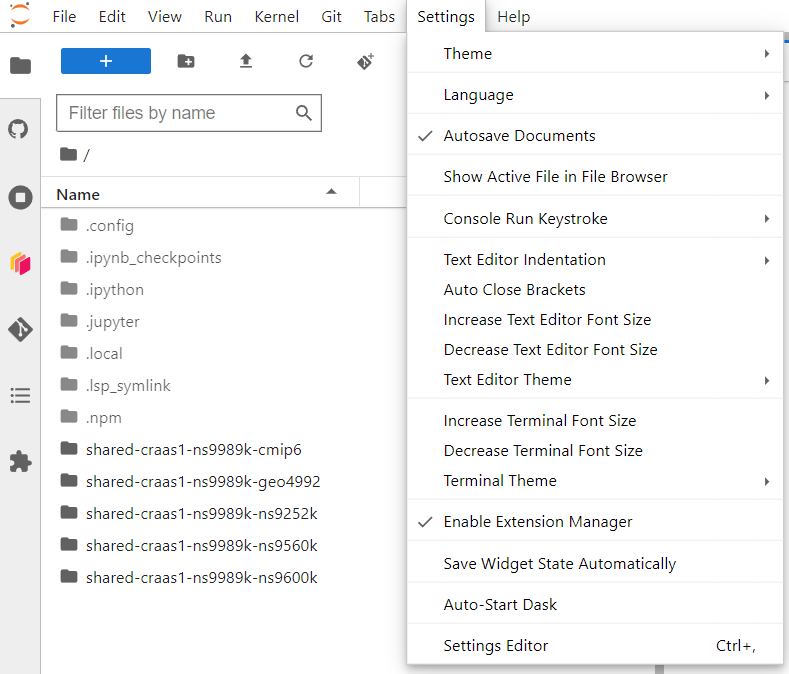
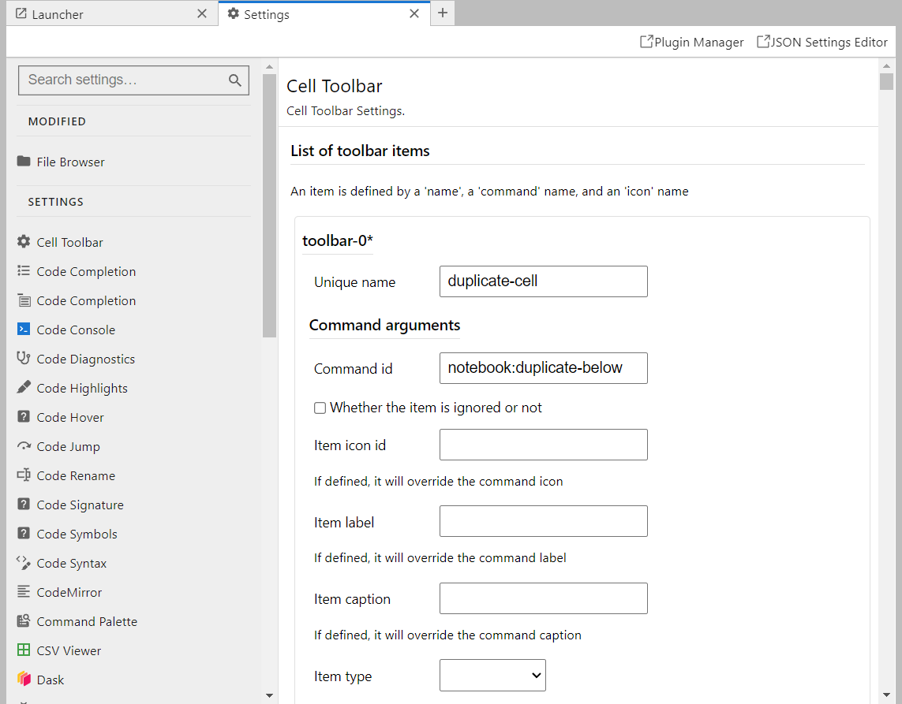
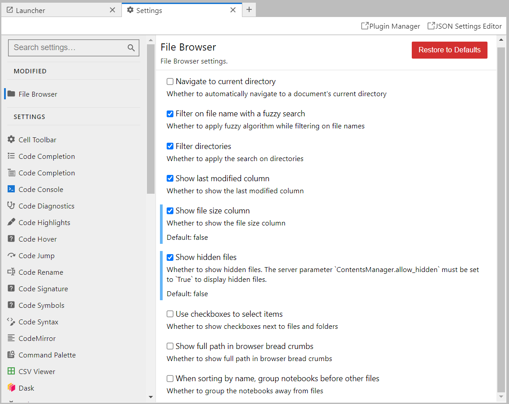

JupyterLab settings
~~~~~~~~~~~~~~~~~~~

If you want to change some JupyterLab settings. You can o into **Settings** -\> **Settings Editor**.

There, you will see settings that control JupyterLab extensions and looks.

Here, for example, you can change the visibility of hidden files (the ones that start with the ``.`` in linux).

Styling warnings in notebooks
~~~~~~~~~~~~~~~~~~~~~~~~~~~~~

On the Jupyterhub, we are using ``pylsp`` as a language-server for linting, styling, formatting and other features.

If you are annoyed by ``~~~~~~`` wigly lines, you can disable some of them by ignoring them when ``pylsp`` compares your code to `PEP8 style convention <https://peps.python.org/pep-0008/>`_.
You can check the error codes `here <https://pycodestyle.pycqa.org/en/latest/intro.html#error-codes>`_.

To do that. You can go to the file ``~/.config/pycodestyle`` and add the error codes you do not like to the ignore list.