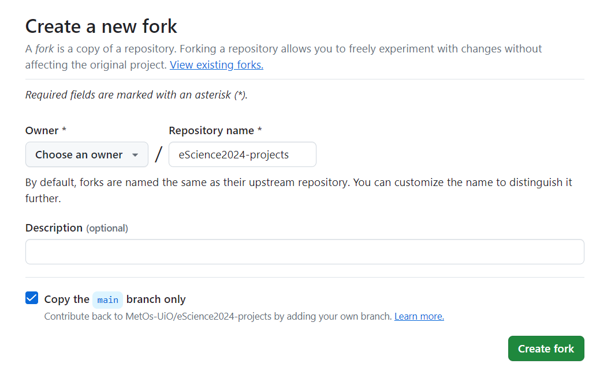

Setting up
==========

Forking projects repository
~~~~~~~~~~~~~~~~~~~~~~~~~~~

.. |fbutton| image:: img/fork_button.png

Before you start working on your group projects. You should fork `eScience2024-projects repo <https://github.com/MetOs-UiO/eScience2024-projects>`_.
To make a fork, go to the repo page. There you will see a ``fork`` button |fbutton|. Click on it to create a copy of this repository in your github user space.
**Uncheck** ``Copy the main branch only`` if you do not want to miss on other branches currently on the original repo.

After you have forked the projects repo you should login to `Jupyterhub <https://escience2024-test.craas1.sigma2.no>`_. 
There, you would need to clone your fork and create your first branch you would be working on. See :doc:`Starting with git on the jupyterhub <../git_integration/git_jlab>`.

Sharing your work within the group
~~~~~~~~~~~~~~~~~~~~~~~~~~~~~~~~~~

Within your fork, you should put all your code in your ``Group#`` folder.

When you need to share your work with the others within your group you need to make a :doc:`Pull Request <../git_integration/github-work>` to the `upstream repo <https://github.com/MetOs-UiO/eScience2024-projects>`_ ``main`` branch.

After a Teaching assistant responsible for you group has merged your PR to ``upstream/main`` other members of your group can pull these changes into branches on their forks to work on.

In addition, you will most likely want to create new branches based on the updated ``upstream/main``. See :doc:`Setting up remotes <../git_integration/remotes>`.
