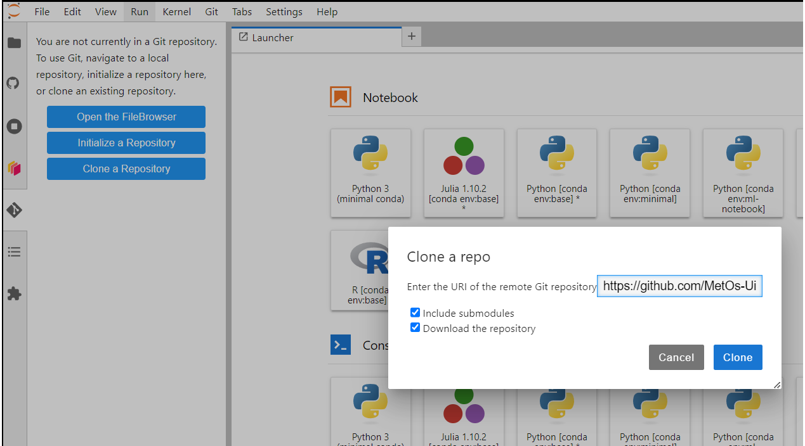
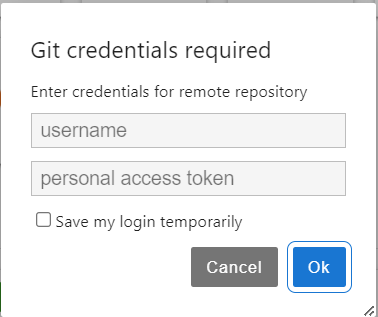

Starting with git on the jupyterhub
===================================

Adding your git username and email
----------------------------------

First thing that you would want to do is to add your github username and email to the ``git config``.
To do that, open a terminal (f.e. through launcher) and do:

.. code-block:: bash

   git config --global user.name "<your_username>"
   git config --global user.email "<your_email>"

You can check if the config is added by doing ``git config --get user.name``.

Using git GUI extension:
------------------------

We have added a GUI extension ti jupyterlab for easier work with git.
You can see a git icon |gitico| on the left panel. To clone a repository, click on the icon and then on **Clone Reopsitory**. 
You should see the following promt:

Chek both boxes and press **Clone**. You will get the following promt:

If you do not know what a personal access token is follow `official github instructions <https://docs.github.com/en/enterprise-server@3.9/authentication/keeping-your-account-and-data-secure/managing-your-personal-access-tokens>`_ to create one. Usually, the tokens start with ``ghp_***``. Treat this token as a password. 
Once you've logged in you will see in the file browser that a folder was created with the same name as the repo you have cloned.
Go into that folder in the file browser and then click on the git tab |gitico| in the left panel. You will see the following:

.. image:: img/repo-tab.png
   :width: 200
   :alt: Repo tab GUI

You can hover over different tabs and buttons too see what they do.
If you click on **History** tab, you will see the beautiful graph of the commit-history of the branch you are currently on.
You can clone multiple repositories and if you are in some repo folder within your file browser you can always click on the git icon to use version control for that specific repository.

Pulling and pushing and fetching are done using the cloud buttons |ppbuttons| at the top right of the panel.

Using git CLI
-------------

You can also use git within the command line.
To do that, Open a terminal through the **Launcher**. That will open the terminal at your current directorly.
To see the aboslute path of where are you at use ``pwd``. Now, we will clone a repository that we use for the course (assuming you made a fork of it).

.. code-block:: bash

  git clone <repository url> <folder>

  cd <folder>

If the ``folder`` is not provided, the repository will be cloned into a folder with the same name as a repository.
Since we are using private repositories, you will get promted to authenticate. Use your github username and `token  <https://docs.github.com/en/enterprise-server@3.9/authentication/keeping-your-account-and-data-secure/managing-your-personal-access-tokens>`_.

Once you are in the repo folder. You can create a new branch for a feature/piece of work you will be working on, so you can make a pull request to the upstream repo later.
To see what branch are you on right now and any changes you have made use ``git status``.

.. code-block:: bash

  git switch -c my-new-branch

  git status

You will see that you just created a new branch and that you are up-to-date with it. Note, this branch is local and does not exist yet on github repo.

Now, suppose you made some changes to a file ``file.txt``. You want to commit the changes and than push it to the remote (your repo on git hub). To commit your changes, you can add a single file, multiple files or all the changes.

.. code-block:: bash

  #this will stage a single file
  git add file.txt
  #this will stage multiple files
  git add file1.txt file2.txt ...

To commit the files you have staged:

.. code-block:: bash

  git commit -m "commit-message, changed file.txt"

You can commit all the changes at once:

.. code-block:: bash

  git commit -a -m "changed bunch of stuff"

Once you've made commits, you want to push them to the remote repository:

.. code-block:: bash

  #--set-upstream origin my-new-branch is only needed once
  # for every newly created branch to push it along with commits.
  git push --set-upstream origin my-new-branch
  # after that you can just simply do:
  git push

To pull changes from the remote to your local repo use ``git pull``. To get updated history (branches, tags etc) from the remote use ``git fetch -a``.