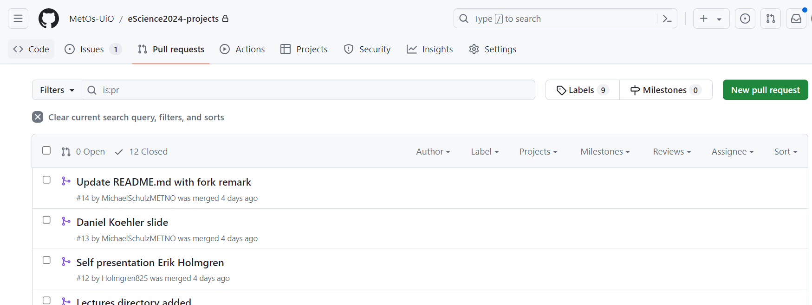

Pull requests and Issues
========================

Issues
======

Let's say you have found a bug in the code or want to request propose some new functionality for a code that is in some repo on GitHub.
A good way to do it is to use Issues to keep the track record.

On the GitHub web-page associated with the repo, you can find an Issues tab.

.. image:: img/issues-tab.png
   :width: 800
   :alt: Issues

There, you will see opened and closed issues, search through them, sort etc. To create a new Issue simply click on ``New Issue`` on the right.

.. image:: img/new-issue.png
   :width: 800
   :alt: New Issue

GitHub uses MarkDown with some extra features for formating comments and messages ont GitHub web-pages.
You can read about the basics of formatting on the `github documentation <https://docs.github.com/en/get-started/writing-on-github/getting-started-with-writing-and-formatting-on-github/basic-writing-and-formatting-syntax>`_.

Pull requests
-------------

When you have developed some code and want other people to use it. For that, you will need to create a Pull Request.
There is a Pull Requests tab near the Issues tab on the GitHub page of your repository. If you click on it, you will get similar page as the one for Issues:

When you click on the ``New Pull Request`` you will see a promt to choose which branch you are pulling from and which you are pulling into:

.. image:: img/new-pr.png
   :width: 800
   :alt: Pull Requests

``base repository`` and ``base`` correspond to the repo and branch you want your changes to **go in**.

``head repository`` and ``compare`` correspond to the repo and branch you want changes **from**.

.. attention:: 
  :class: toggle

  When submitting a Pull Request, double check that you are pulling the intended branch into intended remote.

After you have chosen correct branches, you will see the comparison between them if you scroll down.
To create a Pull Request click on **Create pull request**. Now you will se a page simmilar to the one you get when creating a new issue.
Give your PR a meaningful title and description and check ``Allow edits by maintainers`` if you want people responsible for the repo your are pulling into to have access to your branch associated with the PR. 
You can also request specific maintainers/users to review you PR. After you are done, press **Create pull request** again. 